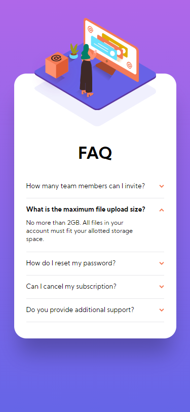

<h1 align="center">
    
</h1>

<h1 align="center">
    <a href="#"> FAQ accordion card </a>
</h1>

<h3 align="center">
    Front end Challengers
</h3>

  

  

  
  

   
   

  

<h4 align="center"> 
	 Status: Finished
</h4>

 <a href="#about">About</a> •
 <a href="#layout">Layout</a> • 
 <a href="#tech">Tech</a> • 
 <a href="#author">Author</a> • 
 <a href="#user-content-license">License</a>

## 💻 About

 FAQ daccordion card - is a challenger with newbie level by [Frontend Mentor](https://www.frontendmentor.io/challenges/faq-accordion-card-XlyjD0Oam). The challenge is to build out this FAQ accordion card and get it looking as close to the design as possible.

---

## 🎨 Layout

Sketch and Figma 

  

  

### Mobile

  

### Web

  

---

## Tech

The following tools were used in the construction of the project:

#### **Card** 

-   **[Html](https://developer.mozilla.org/en-US/docs/Glossary/HTML)**
-   **[Pure CSS3](https://developer.mozilla.org/en-US/docs/Web/CSS)**

## How to contribute

1. Fork the project.
2. Create a new branch with your changes: `git checkout -b my-feature`
3. Save your changes and create a commit message telling you what you did: `git commit -m" feature: My new feature "`
4. Submit your changes: `git push origin my-feature`

---

## Author

<a href="https://blog.rocketseat.com.br/author/thiago/">
 
  
 <b>Daniel Bastos</b></a> 
  

 

---

## License

This project is under the license [MIT](./LICENSE).
